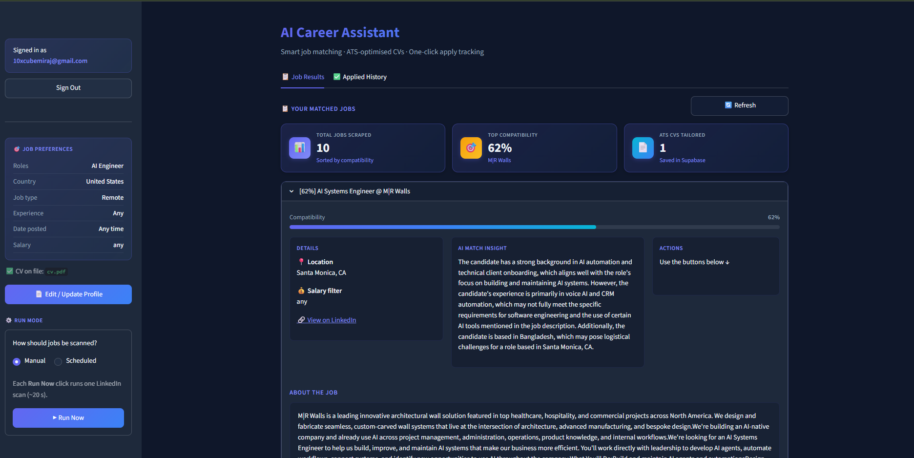
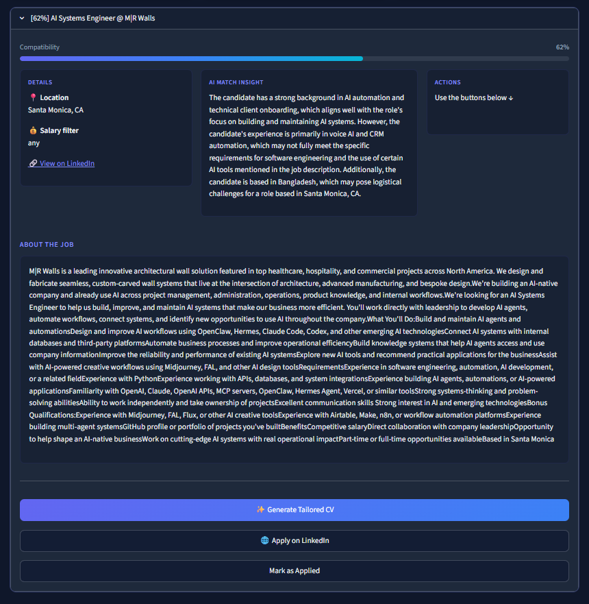
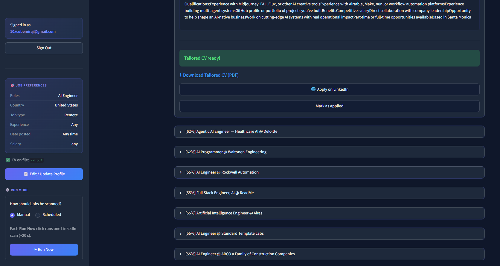

# AI Career Automation Assistant

> An autonomous, multi-tenant AI assistant that finds relevant LinkedIn jobs, scores each one against your CV, and generates a tailored, ATS-optimised resume on demand.

Built with **Streamlit · FastAPI · LangGraph · OpenAI · Supabase**, packaged as a single Docker container behind nginx and deployed on Render.

---

### Live Demo

**[cv-optimizer-agent-3.onrender.com](https://cv-optimizer-agent-3.onrender.com/)**

Try it instantly with the shared demo account — no sign-up needed:

| | |
|---|---|
| **Email** | `10xcubemiraj@gmail.com` |
| **Password** | `Miraj123` |

> ⚠️ **Live Demo Note:** This project is hosted on a free cloud container. If the site has been inactive, the first load may take approximately 50 seconds to wake up the server. Thank you for your patience!

> The demo account is shared and public — please don't store anything sensitive.

---

## Highlights

- **Agentic pipeline** — two LangGraph workflows (job evaluation + CV optimisation) orchestrate scraping, LLM reasoning, and document generation.
- **ATS-optimised resumes** — generates a job-tailored, single-page PDF that mirrors job keywords while preserving every factual detail from the original CV.
- **Guaranteed one-page output** — a render-and-measure guard re-flows the PDF until it fits one page, regardless of content length or environment.
- **Multi-tenant & secure** — Supabase Auth with row-level security; every user only sees their own data and CVs.
- **Production packaging** — single container, nginx reverse proxy, one public URL for both UI and API, health checks, and a Render blueprint.
- **Scheduling** — optional daily cron runs per user via APScheduler.

---

## How it works

```
Browser
   │
   ▼
nginx  (single public URL)
   ├── /            → Streamlit UI        (app.py)
   ├── /api/*       → FastAPI + APScheduler (backend.py)
   └── /auth/*      → Email verification landing page
                         │
                         ▼
            ┌───────────────────────────┐
   Phase 1  │  Evaluate  (eval_graph)   │  Apify → OpenAI → Supabase
            └───────────────────────────┘
            ┌───────────────────────────┐
   Phase 2  │  Optimise (optimize_graph)│  OpenAI → PDF → Supabase Storage
            └───────────────────────────┘
```

**Phase 1 — Job evaluation** (manual *Run Now* or scheduled): scrapes recent LinkedIn postings, scores each against the user's CV (0–100) with a short rationale, and persists results.

**Phase 2 — CV optimisation** (on demand): rewrites the CV as ATS-friendly HTML tailored to a specific job, renders it to a one-page PDF, and returns a signed download URL.

---

## Tech stack

| Layer | Technologies |
|---|---|
| Frontend | Streamlit |
| Backend | FastAPI, APScheduler |
| AI / orchestration | LangGraph, LangChain, OpenAI GPT-4o-mini |
| Data & auth | Supabase (Auth, Postgres, Storage) |
| Job data | Apify (LinkedIn Jobs actor) |
| PDF generation | xhtml2pdf + reportlab |
| Packaging & deploy | Docker, nginx, Render |

---

## Screenshots

**Matched-jobs dashboard** — scraped jobs ranked by compatibility, with preferences and run controls in the sidebar.



**AI match insight & actions** — per-job rationale, full description, and one-click actions (generate CV, apply, mark applied).



**Tailored CV generated** — an ATS-optimised, one-page PDF ready to download for the selected role.



---

<details>
<summary><strong>Run locally</strong></summary>

### Prerequisites

- Python 3.12+
- A Supabase project (run the SQL in the section below)
- OpenAI API key and Apify API token

### 1. Clone and install

```bash
git clone https://github.com/mdmiraj7308-hue/cv-optimizer-agent.git
cd cv-optimizer-agent

python -m venv .venv
# Windows
.venv\Scripts\activate
# macOS / Linux
source .venv/bin/activate

pip install -r requirements.txt
```

### 2. Configure environment

Create a `.env` file in the project root:

```env
OPENAI_API_KEY=sk-...
OPENAI_MODEL=gpt-4o-mini

SUPABASE_URL=https://xxxx.supabase.co
SUPABASE_ANON_KEY=eyJ...
SUPABASE_SERVICE_ROLE_KEY=eyJ...

APIFY_API_TOKEN=apify_api_...
APIFY_ACTOR_ID=curious_coder/linkedin-jobs-scraper

# Local defaults (no change needed)
FASTAPI_BASE_URL=http://localhost:8000
STREAMLIT_BASE_URL=http://localhost:8501
AUTH_CONFIRM_URL=http://localhost:8000/auth/confirm
SCHEDULER_TIMEZONE=Asia/Dhaka
```

### 3. Configure Supabase Auth

In **Supabase → Authentication → URL Configuration**:

| Setting | Value |
|---|---|
| Site URL | `http://localhost:8000/auth/confirm` |
| Redirect URLs | `http://localhost:8000/auth/confirm` and `http://localhost:8501` |

> FastAPI must be running when you click the email verification link.

### 4. Start the app (two terminals)

```bash
# Terminal 1 — backend
uvicorn backend:fastapi_app --reload --port 8000

# Terminal 2 — frontend
streamlit run app.py
```

Open [http://localhost:8501](http://localhost:8501).

</details>

<details>
<summary><strong>Deploy to Render (single URL)</strong></summary>

The repo ships a single-container setup: nginx routes traffic to both Streamlit and FastAPI behind one public URL.

1. Push the repo to GitHub.
2. On [Render](https://render.com): **New → Web Service** → connect the repo.
3. Set **Runtime** = Docker, **Plan** = Free, **Health Check Path** = `/health`.
4. Add environment variables:

| Variable | Required |
|---|---|
| `OPENAI_API_KEY` | Yes |
| `SUPABASE_URL` | Yes |
| `SUPABASE_ANON_KEY` | Yes |
| `SUPABASE_SERVICE_ROLE_KEY` | Yes |
| `APIFY_API_TOKEN` | Yes |
| `OPENAI_MODEL` | No (default `gpt-4o-mini`) |
| `SCHEDULER_TIMEZONE` | No (default `Asia/Dhaka`) |

Public URLs are derived automatically from Render's `RENDER_EXTERNAL_URL` — no manual URL config needed.

5. After deploy, add your Render URL to **Supabase → Authentication → URL Configuration**:

| Setting | Value |
|---|---|
| Site URL | `https://<your-app>.onrender.com/auth/confirm` |
| Redirect URLs | `https://<your-app>.onrender.com/auth/confirm` and `https://<your-app>.onrender.com` |

### Local single-container test

```bash
docker build -t cv-optimizer-agent .
docker run --rm -p 10000:10000 --env-file .env \
  -e PUBLIC_BASE_URL=http://localhost:10000 cv-optimizer-agent
```

Open [http://localhost:10000](http://localhost:10000).

</details>

<details>
<summary><strong>Environment variables reference</strong></summary>

| Variable | Description | Default |
|---|---|---|
| `OPENAI_API_KEY` | OpenAI secret key | — |
| `OPENAI_MODEL` | Model for both agents | `gpt-4o-mini` |
| `SUPABASE_URL` | Supabase project URL | — |
| `SUPABASE_ANON_KEY` | Anon key (Streamlit / client) | — |
| `SUPABASE_SERVICE_ROLE_KEY` | Service role key (backend) | — |
| `APIFY_API_TOKEN` | Apify API token | — |
| `APIFY_ACTOR_ID` | LinkedIn scraper actor | `curious_coder/linkedin-jobs-scraper` |
| `FASTAPI_BASE_URL` | URL Streamlit uses for API calls | `http://localhost:8000` |
| `STREAMLIT_BASE_URL` | App URL on the welcome page | `http://localhost:8501` |
| `AUTH_CONFIRM_URL` | Supabase email redirect URL | `http://localhost:8000/auth/confirm` |
| `PUBLIC_BASE_URL` | Override for single-URL Docker deploy | — |
| `SCHEDULER_TIMEZONE` | APScheduler timezone | `Asia/Dhaka` |

On Render, `RENDER_EXTERNAL_URL` is injected automatically and configures the public URLs.

</details>

<details>
<summary><strong>Supabase setup (SQL)</strong></summary>

Run the following in your Supabase **SQL Editor**.

```sql
-- 1. UUID extension
create extension if not exists "uuid-ossp";

-- 2. profiles
create table public.profiles (
    user_id     uuid primary key references auth.users(id) on delete cascade,
    target_roles text[]          not null default '{}',
    location    text             not null default '',
    job_type    text             not null default 'any'
                    check (job_type in ('any', 'remote', 'onsite')),
    salary_min  integer,
    salary_max  integer,
    salary_raw  text             not null default '',
    run_mode    text             not null default 'manual'
                    check (run_mode in ('scheduled', 'manual')),
    run_hour    integer          check (run_hour between 0 and 23),
    original_cv_url text,
    created_at  timestamptz      not null default now()
);
alter table public.profiles enable row level security;
create policy "Users manage own profile"
    on public.profiles for all
    using (auth.uid() = user_id) with check (auth.uid() = user_id);

-- 3. processed_jobs
create table public.processed_jobs (
    id                      uuid primary key default uuid_generate_v4(),
    user_id                 uuid not null references public.profiles(user_id) on delete cascade,
    job_title               text not null,
    company                 text not null default '',
    location                text not null default '',
    job_url                 text not null default '',
    job_description_md      text not null default '',
    posted_at               timestamptz,
    compatibility_score     float not null default 0,
    evaluation_summary      text not null default '',
    optimized_cv_generated  boolean not null default false,
    optimized_cv_url        text,
    processed_at            timestamptz not null default now()
);
alter table public.processed_jobs enable row level security;
create policy "Users read own jobs"
    on public.processed_jobs for select using (auth.uid() = user_id);
create policy "Service role insert/update jobs"
    on public.processed_jobs for all using (true) with check (true);

-- 4. application_tracking
create table public.application_tracking (
    id                  uuid primary key default uuid_generate_v4(),
    user_id             uuid not null references public.profiles(user_id) on delete cascade,
    processed_job_id    uuid not null references public.processed_jobs(id) on delete cascade,
    marked_applied_at   timestamptz not null default now(),
    cv_downloaded       boolean not null default false,
    unique (user_id, processed_job_id)
);
alter table public.application_tracking enable row level security;
create policy "Users manage own applications"
    on public.application_tracking for all
    using (auth.uid() = user_id) with check (auth.uid() = user_id);

-- 5. Storage bucket for CVs
insert into storage.buckets (id, name, public)
values ('cvs', 'cvs', false) on conflict (id) do nothing;
create policy "Users manage own CVs"
    on storage.objects for all
    using  (bucket_id = 'cvs' and auth.uid()::text = (storage.foldername(name))[2])
    with check (bucket_id = 'cvs' and auth.uid()::text = (storage.foldername(name))[2]);
create policy "Service role manages all CVs"
    on storage.objects for all
    using (bucket_id = 'cvs') with check (bucket_id = 'cvs');
```

Storage paths:
- `original/{user_id}/cv.pdf` — user-uploaded CV
- `optimized/{user_id}/{job_id}.pdf` — generated ATS CV

</details>

---

## Project structure

```
cv-optimizer-agent/
├── app.py                  # Streamlit entry point
├── backend.py              # FastAPI + APScheduler
├── deploy/
│   ├── nginx.conf.template # Reverse proxy routes
│   └── start.sh            # Single-container startup
├── src/
│   ├── config/             # Pydantic settings
│   ├── core/               # LLMs, tools, state, PDF
│   ├── prompts/            # System prompts
│   ├── ui/                 # Streamlit UI (sidebar, display, theme)
│   └── workflow/           # LangGraph agents, nodes, graphs
├── Dockerfile
├── render.yaml
└── requirements.txt
```

---

## License

Released under the MIT License.

## Author

**Md Miraj Islam**
[GitHub](https://github.com/mdmiraj7308-hue) · [LinkedIn](https://www.linkedin.com/in/mdmirajislam/)
